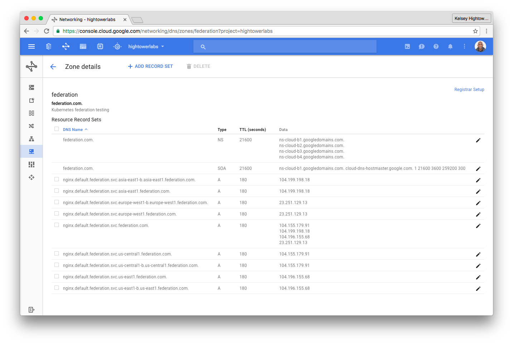

# Federated NGINX Service

This lab will walk you through creating a federated NGINX service backed by the following federated objects:

* replicaset - to ensure the nginx pod runs 
* service

## Prerequisites

### Store the GCP Project Name

```
export GCP_PROJECT=$(gcloud config list --format='value(core.project)')
```

## Federated NGINX ReplicaSet

Federated replica sets leverage the same configuration as a non-federated Kubernetes clusters. By default pods created by a replica set are distributed evenly across all configured clusters.

```
kubectl --context=federation-cluster get clusters
```
```
NAME               STATUS    VERSION   AGE
gce-asia-east1     Ready     1h
gce-europe-west1   Ready     1h
gce-us-central1    Ready     1h
gce-us-east1       Ready     1h
```

The following command will create an nginx replica set and create 4 nginx pods.

```
kubectl --context=federation-cluster create -f rs/nginx.yaml
```

### Verify

```
kubectl --context=federation-cluster get rs
```
```
NAME      DESIRED   CURRENT   AGE
nginx     4         0         13m
```

### List Pods

List the cluster level nginx pods for the following cluster contexts:

* gke_${GCP_PROJECT}_asia-east1-b_gce-asia-east1
* gke_${GCP_PROJECT}_europe-west1-b_gce-europe-west1
* gke_${GCP_PROJECT}_us-east1-b_gce-us-east1
* gke_${GCP_PROJECT}_us-central1-b_gce-us-central1

#### Example

```
kubectl --context="gke_${GCP_PROJECT}_us-central1-b_gce-us-central1" get pods
```
```
NAME          READY     STATUS    RESTARTS   AGE
nginx-z5wkd   1/1       Running   0          3m
```

## Federated NGINX Service

Create a federated service object in the `federation-cluster` context.

```
kubectl --context=federation-cluster create -f services/nginx.yaml
```

Wait until the nginx service is propagated across all 4 clusters and the federated service is updated with the details. Currently this can take up to 5 mins to complete.

### Verify

Describe the federated nginx service.

```
kubectl --context=federation-cluster describe services nginx
```
```
Name:			nginx
Namespace:		default
Labels:			app=nginx
Selector:		app=nginx
Type:			LoadBalancer
IP:			
LoadBalancer Ingress:	104.155.179.91, 104.199.198.18, 104.196.155.68, 23.251.129.13
Port:			http	80/TCP
Endpoints:		<none>
Session Affinity:	None
No events.
```

### List Services

List the cluster level nginx services for the following cluster contexts:

* gke_${GCP_PROJECT}_asia-east1-b_gce-asia-east1
* gke_${GCP_PROJECT}_europe-west1-b_gce-europe-west1
* gke_${GCP_PROJECT}_us-east1-b_gce-us-east1
* gke_${GCP_PROJECT}_us-central1-b_gce-us-central1

#### Example

```
kubectl --context="gke_${GCP_PROJECT}_us-central1-b_gce-us-central1" \
  describe services nginx
```

```
Name:                   nginx
Namespace:              default
Labels:                 app=nginx
Selector:               app=nginx
Type:                   LoadBalancer
IP:                     10.87.255.25
LoadBalancer Ingress:   XXX.XXX.XXX.XX
Port:                   http	80/TCP
NodePort:               http	30330/TCP
Endpoints:              10.84.1.5:80
Session Affinity:       None
```


### Review Cloud DNS Console

The Federated controller manager creates DNS entires in the configured zone.




